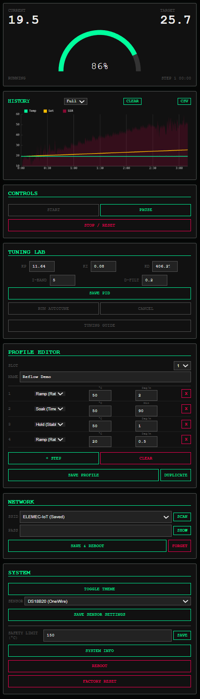
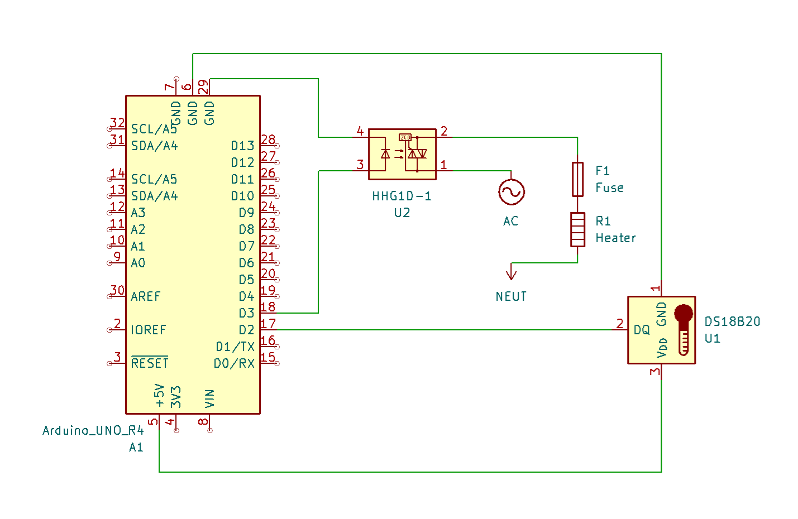
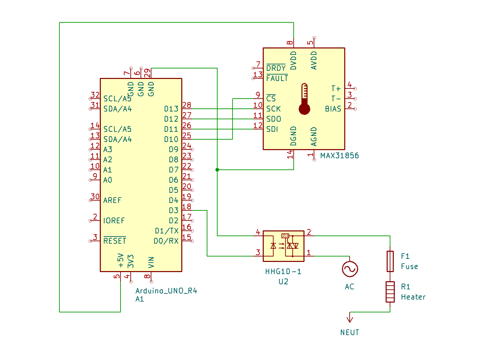

# Arduino R4 WiFi Thermal PID Controller

A robust, web-based PID temperature controller designed for the **Arduino UNO R4 WiFi**. This project provides a modern, responsive Single Page Application (SPA) interface to control heating elements (via SSR) for applications like reflow ovens, sous-vide, or general thermal process control.

## 🌟 Features

*   **Web Dashboard**: Real-time monitoring of temperature, setpoint, and power output with an interactive chart.
*   **PID Control**: Full PID implementation with anti-windup (Integral Separation) and derivative filtering.
*   **Autotune**: Built-in Relay Method autotuning to automatically calculate optimal PID parameters.
*   **Profile Engine**: Support for complex thermal profiles with multiple step types:
    *   **Ramp (Time)**: Reach target over a specific duration.
    *   **Soak (Time)**: Hold temperature for a duration.
    *   **Ramp (Rate)**: Ramp at a specific rate (e.g., 2°C/min).
    *   **Hold (Stable)**: Wait until temperature stabilizes.
    *   **Wait (Input)**: Wait for a digital input signal.
*   **Dual Sensor Support**: Supports **DS18B20** (OneWire) and **MAX31856** (Thermocouple) sensors.
*   **Connectivity**:
    *   **Dual Mode**: Works as a WiFi Access Point (AP) and connects to an existing WiFi network simultaneously.
    *   **WebSockets**: Fast, low-latency telemetry and control.
*   **Data Persistence**: Saves PID settings, profiles, and WiFi credentials to EEPROM.
*   **Safety**: Configurable hard safety temperature limit.
*   **UI Themes**: Toggle between Cyberpunk Dark and Clean Light themes.

## 📸 Screenshot



## 🛠️ Hardware Requirements

*   **Arduino UNO R4 WiFi**
*   **Solid State Relay (SSR)**: To control the heating element.
*   **Temperature Sensor**:
    *   **Option A**: DS18B20 Digital Sensor (requires 4.7kΩ pull-up resistor).
    *   **Option B**: MAX31856 Thermocouple Amplifier + K-Type Thermocouple.
*   **Heating Element**: Oven, Hot plate, etc.

### Wiring




| Component | Arduino Pin | Notes |
| :--- | :--- | :--- |
| **SSR Control** | Pin 3 | Connect to SSR Input (+) |
| **DS18B20 Data** | Pin 2 | Requires 4.7kΩ pull-up to 5V |
| **MAX31856 CS** | Pin 10 | Chip Select |
| **MAX31856 DI** | ICSP MOSI - Pin D11 | SPI MOSI  
| **MAX31856 DO** | ICSP MISO - Pin D12| SPI MISO | 
| **MAX31856 CLK** | ICSP SCK - Pin D13| SPI Clock | 

## 📦 Software Dependencies

You need to install the following libraries via the Arduino Library Manager:

1.  **OneWire**
2.  **DallasTemperature**
3.  **Adafruit MAX31856**
4.  **ArduinoGraphics** (Standard R4 library)
5.  **Arduino_LED_Matrix** (Standard R4 library)

### Python Tools (For Development)
If you plan to modify the `index.html` web interface, you will need Python installed to regenerate the embedded assets.

```bash
pip install minify-html
```

## 🚀 Installation

1.  **Clone the Repository**:
    ```bash
    git clone https://github.com/zwitterion/R4-Thermal-Controller.git
    ```
2.  **Open in Arduino IDE**: Open `pid_controller.ino`.
3.  **Select Board**: Tools > Board > Arduino UNO R4 WiFi.
4.  **Upload**: Connect your board and click Upload.

*Note: The web interface is already compiled into `web_assets.h`. You do not need to run the python script unless you modify `index.html`.*

## 📖 Usage Guide

### 1. Initial Setup (WiFi)
1.  Power on the controller.
2.  Connect your phone or laptop to the WiFi network named **`R4-Controller`**.
3.  Open a browser and navigate to `http://192.168.4.1`.
4.  Go to the **Network** card, enter your home WiFi SSID and Password, and click **Save & Reboot**.
5.  The controller will now connect to your home WiFi (displaying the IP on the Serial Monitor and LED the Matrix dsiplay) but the AP remains active as a fallback.

### 2. Sensor Configuration
1.  In the Web UI, scroll down to the **System** card.
2.  Select your sensor type (**DS18B20** or **MAX31856**).
3.  If using a thermocouple, select the correct Type (e.g., Type K).
4.  Click **Save Sensor Settings**. The board will reboot.

### 3. PID Tuning
*   **Manual**: Enter Kp, Ki, Kd values in the **Tuning Lab** card and click Save.
*   **Autotune**:
    1.  Ensure the system is safe to heat up.
    2.  Click **Run Autotune**.
    3.  The system will oscillate around 100°C (default) to learn the thermal properties.
    4.  Once complete, new PID values are automatically saved.

### 4. Running a Profile
1.  Go to **Profile Editor**.
2.  Select a Slot (1-5).
3.  Add steps (Ramp, Soak, etc.) to define your thermal process.
4.  Click **Save Profile**.
5.  Go to **Controls** and click **Start**.

## 📄 License

MIT License

## About the Author
Hi, I'm Jose Saura — a retired software engineer exploring chemistry, technology, culture, and creative engineering. You can find more of my work on my blog:
👉 [Visit my blog](http://www.egooge.com)
